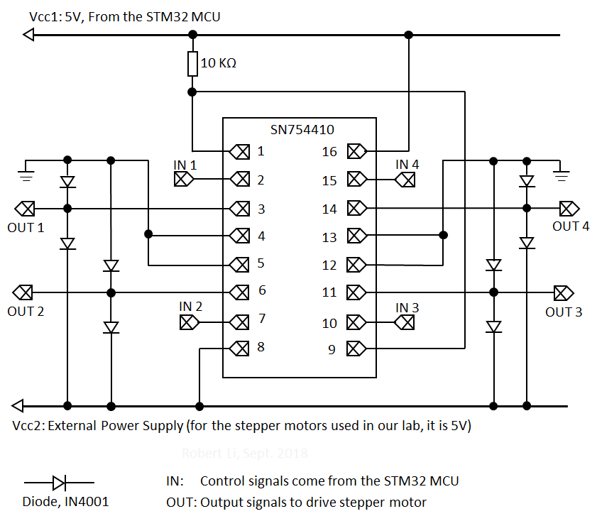
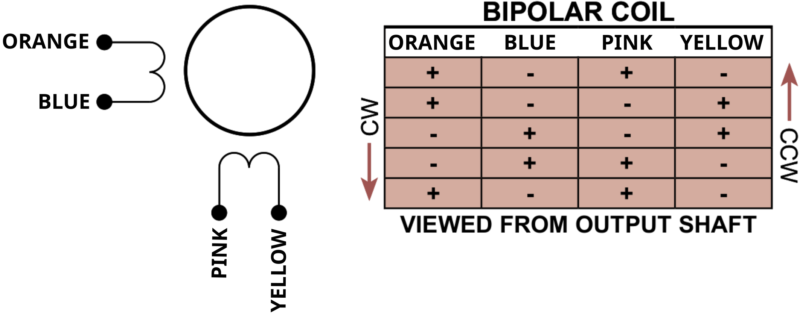

# Lab 05: Control of a Stepper Motor

## Introduction

In this lab you will learn how to interface the microcontroller with a stepper motor and also how to drive such a motor in full/half step mode and clockwise/counterclockwise direction, while controlling the speed of rotation.

## Prelab
This lab assumes you are familiar with the material required for Labs 0 - 4.

**Reading:** In addition to the class notes, you should read the following:

* [Overview](./readings/Stepper.pdf) of stepper motors, their specifications, and terminology
* [Stepper Motor Technology Background](./readings/smh29.pdf)

## Tpoics
* Stepper motors ([Datasheet](./readings/108990003_Web.pdf))
* H-bridge driver [SN754410NE](./readings/sn754410.pdf)

## Hardware 

The stepper motors used in our lab are of model [24BYJ48S](./readings/108990003_Web.pdf). They are bipolar 32 step  (5.625 degrees) motors and are rated at 5V. To drive this motor, any of the sequences of signals described in class can be used.

In general, a signal conditioning stage is needed for driving a stepper motor. In the lab we will use the [SN754410NE](./readings/sn754410.pdf) H-bridge driver. In addition, we will use 8 diodes to protect the control circuitry from voltage spikes that would otherwise be produced by the windings (see page 6 of the SN754410 datasheet).

A sequence of signals will be generated using a timer of the MCU to control appropriate switches in the H-bridge. The outputs of the H-bridge will be connected to the four terminals of the motor. A block diagram of the equipment arrangement is shown below:

Here is a schematic diagram of the connections to the H-Bridge (SN754410):

The DFRduino board cannot handle more than about 400mA when powered from the USB. This means you can connect pins 1, 9 and 16 of the H-bridge to the 5V pin of the DFRduino board and pin 8 and the output wires (connecting to the motor) to an external power source of 5V. The ground pins of the external power source and that of the DFRduino board should be connected together.

## Setup Procedure 

Connect the motor, DFRduino board, and SN754410NE according to the schematic diagrams given above. Note that IN 1-4 are your GPIO outputs while OUT 1-4 are your motor connections. To guide your connections, the schematic and sample step sequence for our stepper motors is shown below:

## System Requirements

### Preliminaries
1. Calculate the angular resolution of the given motor to determine the number of steps per revolution and the angular resolution of each step.
2. In this lab we will use the stepper motor to implement an unusual clock. The motor’s shaft will be connected to a dial of the clock. Hence, we would like the motor to complete one full revolution in a very specific amount of time.
3. The amount of time (seconds per revolution) will be determined from your student number. The starting speed for the first preset will be digits 6 and 7 of your student number, the starting speed for the second preset will be digits 8 and 9. E.g. if your student number is 400123456, your starting speeds will be 34 and 56.
4. To make times reasonable and fairer across the class, you can adjust the starting speeds if it is very low or very high. Please use the following scheme to do that:
    1. If the period is less than 33, add 33 to it and use that number. E.g. if the period corresponding to your student number is 21, which is lower than 33. Then you add 33 to get 54 seconds, which is the period you should use.
    2. If the period is between 33 and 66 (inclusive), use the period unchanged.
    3. If the period is greater than 66, subtract 33 from it and use that number. E.g. if the period corresponding to your student number is 89, which is greater than 66. Then you subtract 33 to get 56 seconds, which is the period you should use.
5. Determine the time period between two steps of the stepper motor used in the lab such that the motor completes one revolution in the time intervals calculated in step 4. Do this for:
    1. Half-stepping sequence.
    2. Full-stepping sequence.

* **3 pts.** Use a multi-line comment at the top of your lab_05.ino file to report the following:
    * The calculation for the angular resolution of your motor
    * Student name, number, and time period between two steps for 5.1 and 5.2 (for both presets)

### Requirements
Design a program to drive the stepper motor in different modes of operation as follows.

* **1 pt.** On startup, the motor should not turn and the LCD should be clear.
* **3 pts.** A push button should be used to switch between the first and second presets. In each preset, use the LCD to print the student's name, number, and the number of seconds per revolution. When entering each preset, print this info to the LCD and run the motor clockwise at the correct starting speed. On the first button press, you may enter either preset and simply switch between the preset on subsequent button presses. 
* **3 pts.** A push button should be used to allow the user to cycle between full or half stepping modes without changing the motor speed (seconds per revolution). Print the current step mode below the student info on the LCD.
* **3 pts.** A push button should be used to allow the user to change motor direction without changing current preset, motor speed, or motor mode (full/half step).
* **3 pts.** The user should be allowed to change the speed of the motor by pressing two buttons, one to increase the speed and one to decrease the speed. Switching presets should reset the motor speed to the correct starting speed for that preset in a clockwise rotation. 

Since the kit only has three push buttons, you can implement the required functionality by differentiating between short and long presses. For example:

| Push Button | Short Press | Long Press |
| -- | -- | -- |
| 1 | Switch between presets | N/A |
| 2 | Full/Half Step Mode | Decrease Speed |
| 3 | Motor Direction | Increase Speed |

Other requirements:

* **3 pts** zipped `lab_05_12345` source directory uploaded to your Avenue drop box for lab-05, where 12345 is your student number. In the event your project isn't fully functional, this may be used to justify partial marks. Your code should contain clear and concise comments are important for others to understand your code and even for you later when you need to remember what you did. This is a requirement for lab-05, otherwise you will receive a mark of zero for preliminaries.
* **3 pts** Motivate your design and implementation decisions to your TA and answer questions about your code.

**As usual, all timing in your code should be done with timers and interrupts.**

## Project Photo

None for this lab. It is a very good idea to sketch your breaboard layout before building the circuit. **Double-check your circuit against the schematic to avoid hardware damage!**
